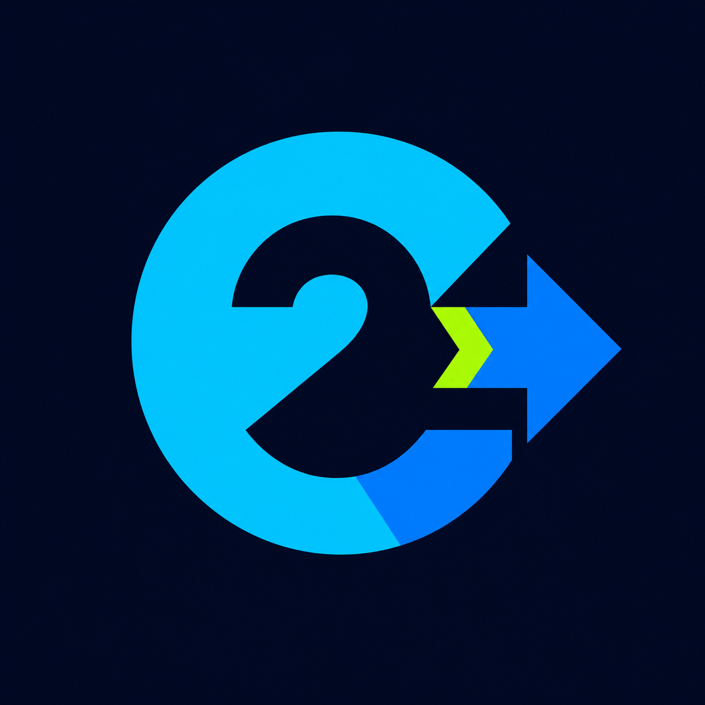

<p align="center">
  
</p>

<h1 align="center">C2Go Toolchain</h1>

<p align="center">
  A coordinated C-to-Go compiler, binding generator, and runtime compatibility layer.
</p>

<p align="center">
  <a href="README.zh-CN.md">简体中文</a>
</p>

> **PRE-RELEASE COORDINATION REPOSITORY — NOT READY FOR PRODUCTION USE**
>
> This repository pins the current coordinated release candidate,
> `v0.20260729.0-rc.3`, as Git submodules. It is an unsigned evaluation release,
> not a production-ready toolchain.

## What this repository is

`c2go-toolchain` is the canonical release-coordination repository for C2Go. It
pins candidate revisions of each top-level component, records the supported Go
and C2Go ABI window, runs fail-closed release checks, and hosts the release notes
and downloadable bundles for each coordinated release.

It is intentionally not a monorepo. Component development and history remain
in their own repositories; this repository becomes the source of truth for the
exact combination shipped under a C2Go toolchain version.

## Components

| Component | Repository | Mount point | Responsibility | License boundary |
| --- | --- | --- | --- | --- |
| c2go-clang | `c2gohq/c2go_clang` | `components/c2go-clang` | LLVM/Clang-based C2Go frontend, lowering, `c2go-lto`, and Plan 9 assembly emission | `Apache-2.0 WITH LLVM-exception`, plus existing third-party notices |
| c2go-bind | `c2gohq/c2go_bind` | `components/c2go-bind` | Converts C2Go assembly and manifests into Go packages | Original C2Go material: `AGPL-3.0-only` or a separate commercial agreement; third-party portions retain their licenses |
| c2go-libc | `c2gohq/c2go_libc` | `components/c2go-libc` | Runtime C-library compatibility and Go runtime bridges | Mixed work: original C2Go material plus musl and other third-party material under their own terms |

The modified `c2gohq/musl` fork is a nested, commit-pinned dependency owned by
the c2go-libc release. It is not a fourth top-level toolchain component.

## Pipeline

```text
C source
   |
   v
c2go-clang + c2go-lto
   |  Plan 9 assembly + export manifest
   v
c2go-bind
   |  generated Go package
   v
c2go-libc + Go toolchain
   |
   v
Go executable or library
```

## Current state

The repository is deliberately fail-closed:

- `.gitmodules` records the three public component remotes, and the gitlinks are
  pinned to commits that are reachable from those remotes;
- [toolchain.lock.json](toolchain.lock.json) records those exact revisions, the
  coordinated RC tag, and immutable release metadata;
- the default release verifier fails unless release metadata, remote tags,
  component revisions, recursive dependencies, and clean worktrees all agree;
  and
- the candidate compatibility window is Go 1.25.x and C2Go ABI epoch 1, covered
  by the native four-target release dry run.

Validate only the scaffold structure with:

```sh
python3 scripts/verify-release.py --structure-only
```

The actual release gate is intentionally stricter:

```sh
python3 scripts/verify-release.py
```

It will not pass until the release metadata, tags, component revisions,
recursive dependencies, and clean working trees all agree.

The release workflow also supports a manually dispatched unsigned dry run. It
builds and tests on native GitHub-hosted runners, then packages:

- relocatable binary SDKs for Linux amd64 and arm64 (`.tar.gz`), Windows amd64
  (`.zip`), and macOS arm64 (`.tar.gz`), each containing only installed
  `bin/`, `include/`, `lib/`, `licenses/`, and release metadata;
- one recursively complete source archive; and
- per-file SHA-256 sidecars plus a combined `SHA256SUMS`.

The binary SDKs do not contain repository checkouts, tests, or source trees.
Each native builder extracts its archive, checks the exact installed header and
license sets, compiles every supported public header without an extra `-I`, and
runs a complete packaged C-to-Go smoke test before upload. The separate source
archive supplies the corresponding source.

A coordinated `v*` tag creates a GitHub Release **draft**. The draft remains a
manual legal, notice, checksum, and installation smoke-test checkpoint; the
workflow never overwrites an existing release and does not currently sign or
notarize artifacts.

## Versioning and first release

Coordinated releases use calendar versions inside a SemVer-compatible envelope:

```text
vMAJOR.YYYYMMDD.REVISION[-rc.N]
```

`MAJOR` identifies the compatibility line (`0` while the project is pre-1.0),
`YYYYMMDD` is the UTC date on which the coordinated release line is cut, and
`REVISION` starts at `0` and increases for another maintenance release on the
same date. Release candidates append `-rc.N`; exact dependency revisions remain
in `toolchain.lock.json`.

The current public candidate is `v0.20260729.0-rc.3`, not a stable release. It is
intended for evaluation, reproducibility checks, and compatibility testing.

See [RELEASING.md](RELEASING.md) for the initialization and release sequence.
The platform archive includes an SDK-specific English and Chinese README with
the matched runtime-module and C-to-Go quick-start instructions.

## Repository layout

```text
.
├── assets/                 Project branding and provenance notes
├── components/             Pinned top-level submodules
├── .github/workflows/      Native multi-platform release build
├── SDK-README*.md          README templates installed in binary SDKs
├── scripts/                Release validation and deterministic packaging
├── toolchain.lock.json     Coordinated version and revision manifest
├── RELEASING.md            Release procedure
├── LICENSING*.md           Aggregate and component license boundaries
├── COMMERCIAL-LICENSING*   Commercial intent; not a license grant
└── TRADEMARKS.md           Name and logo policy
```

## Licensing and branding

Original coordination documentation and scripts in this repository are
available under GNU AGPL version 3 only, with alternative commercial terms
available only under a separately executed agreement. Every component and
generated artifact retains its own applicable license boundary; inclusion as a
submodule does not relicense it.

The C2Go name and logo are branding assets and are not licensed as software
under AGPL merely because they are stored here. See [LICENSE](LICENSE),
[LICENSING.md](LICENSING.md), [COMMERCIAL-LICENSING.md](COMMERCIAL-LICENSING.md),
[NOTICE](NOTICE), and [TRADEMARKS.md](TRADEMARKS.md).

GitHub Sponsors may be designated as a payment channel in a separately
executed commercial agreement. A sponsorship payment alone grants no software
or trademark rights.

## Contributing

Code contributions are not accepted until the project adopts an appropriate
contributor agreement preserving commercial-relicensing rights. Bug reports,
release reproducibility findings, and original documentation feedback are
welcome once the public issue tracker is available. See
[CONTRIBUTING.md](CONTRIBUTING.md).
